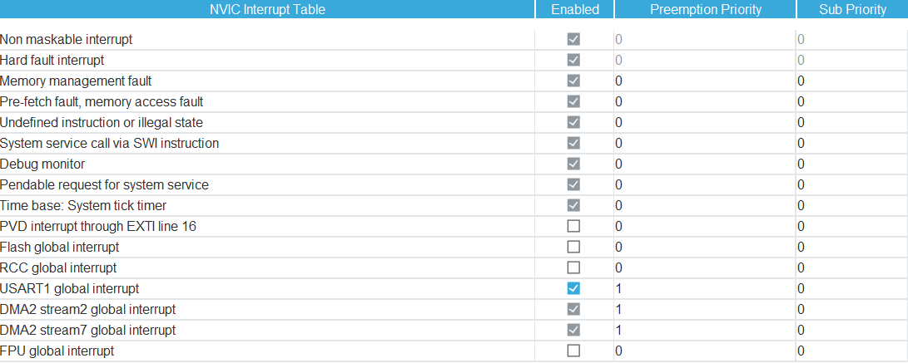

# FC41D Modülü Kurulumu 

FC41D'nin stm32 içinde çalısması için gerekli kurulumların yapılması.


## **İçerikler** 
<!-- TOC depthFrom:2 depthTo:2 updateOnSave:True -->


- [Cube IDE ve Priority Ayarı](#cube-ide-ve-priority-ayarı)
- [DMA Kullanımı ve Çalışması](#dma-kullanımı-ve-çalışması)
- [BLE Peripheral Mod Kod Kurulumu ve Akışı](#ble-peripheral-mod-kod-kurulumu-ve-akışı)
- [WiFi via BLE](#wifi-via-ble)
- [MQTT Ayarı](#mqtt-ayarı)
- [Kesme Icinde Isleme](#kesme-icinde-isleme)
- [Hotspot Ayarları](#hotspot-ayarları)
- [QFLASH ile Yazılım Güncelleme](#qflash-ile-yazılım-güncelleme)


<!-- /TOC -->

<div class="page"/>

## **Cube IDE ve Priority Ayarı**



Dma ve usartın önceligiyle systick aynı kalmamalı çünkü herhangi bir delay fonksiyonunda kesme ve delay çakısırsa sınırsız döngüye neden oluyor yukarıdaki resimdeki gibi çözülebilir.FC41D modulun at komutunu işleme hızı hakkında bilgiye sahip degiliz sadece OK yada Error dönme süresini biliyoruz.Tahmini her komut gönderilip kesmeye girildikten sonra verileri dma nın tam olarak yazması için 2000ms bekleme ile sorun çözülebilir .
## **DMA Kullanımı ve Çalışması**
**

Aşağıda DMA ile USART'ı yapılandıran fonksiyon yer almaktadır:

Bu fonksiyon, **USART**'ı Idle moddayken interrupt'a girmesini sağlar. Bu durumda, belli bir süre veri alımı olmadığında USART işlemi durdurulur ve DMA kullanarak veriler bellekteki **`pRxBuffPtr`** tamponuna (_buffer_) aktarılır ve kesmeye girer.

```c
void SetupDMAUSART() {
    HAL_UARTEx_ReceiveToIdle_DMA(&huart1, RxBuffer, RxBufferSize) ;
    __HAL_DMA_DISABLE_IT(&hdma_usart1_rx, DMA_IT_HT);
}
```
bu kodlardan üstteki kod Usart ıdle moddayken (Belli bir süre veri alımı olmadıgında usartın işlem alımını bitirmesi) interrupta girmesini sağlar ve DMA la memorye pRxBuffPtr bufferine veriyi atar,bu interrupt girmesi dma çalısma grafigindeki TC(transfer Complete durumuna bağlıdır).

Aşagıdaki ayarda DMA nın Usartın üzerinde olması gerekiyor.

HAL_Dısable_IT_HT kodu ise Dma memorye yazma kısmının yarısında ise kesmeye girmesini kapatmaya yarıyor burada öyle bir amacımız olmadıgı için kapattım. 

Aşagıdaki ayarda DMA nın Usartın üzerinde olması gerekiyor.


## **BLE Peripheral Mod Kod Kurulumu ve Akışı**
```c
  void BleSetupFunction() {
    char *BleSettings[] = {
        "AT+QRST\r\n", // modul reseti
        "AT+QBLEINIT=2\r\n",//peripheral modda başlatır ble yi 
        "AT+QBLEADDR?\r\n",//adress sorgulanır
        "AT+QBLENAME=BERKE\r\n",//isim verilir ble cihazına.
        "AT+QBLEGATTSSRV=FFF1\r\n",//Servis açılır bu servisin altında aşagıda karakteristlikler açılıyor.Bu servis ve karakteristlikler hexadecimal olarak ayarlanabilir.
        "AT+QBLEGATTSCHAR=FFF2\r\n", //transfer karakteristligi  veri bu karakteristik üzerinden gönderilir
        "AT+QBLEGATTSCHAR=FFF3\r\n", //burda 2. karakteristliği acabiliriz yukardakinden farkı yok
        "AT+QBLEADVPARAM=150,150\r\n", // bu maximum reklam yayınlama degeridir bu deger cihazın master tarafından bulunmasını kolaylastırır.
        "AT+QBLEADVDATA=0201040BFF42454E204245524B4500\r\n",//hexadecimal olaran yazılan bu kod soldan sağ a dogru  (02 veri uzunlugunu),(01=veri türünü),(04=reklam ayarı),(0BBF=MANUFACTURER DATA (Bu data ble protokolunde belirli başlıklara işaret etmektedir istege göre degistirilebilir ble tarafından tanımlanmıstır.)) kalan kısımda veri ("Ben Berke")
        "AT+QBLEADVSTART\r\n",//bütün ayarlar yapıldıktan sonra bu artık bluetoothu baslatır.
    };

    for (int i = 0; i < 10; i++) {
        memset(TxBuffer, 0, sizeof(TxBuffer));
        strcpy(TxBuffer, Settings[i]);

     HAL_UART_Transmit_DMA(&huart1, (uint8_t*)TxBuffer, strlen(TxBuffer));

        HAL_Delay(500);
     }

    HAL_Delay(500);
}
```
Yukarıdaki kod çalıstırılırken Delay in 500 ms olmasına dikkat edilip kesmedeki delayinde 2000 saniye olması gerekmektedir.

```c
"AT+QBLEGATTSNTFY=FFF2,merhaba\r\n"
//istenilen karakteristiklerde bu şekilde peripheral modda gönderim yapılabilir

void BLEHIGH() {
    HAL_GPIO_WritePin(GPIOC, GPIO_PIN_7, GPIO_PIN_SET); //Modul uyku modundaysa bu pin set edildiginde uyanır (wakeUP)
}

```
<div class="page"/>

### **WiFi via BLE**
```c
void TransmitBleFunction() {


	char *Settings[] = {
    "AT+QRST\r\n",
		"AT+QBLEINIT=3\r\n",//Ble yi wifi modunda baslatıyor BleSetupFunction() fonksiyonunda yaptıgımız ayarları burda otomatik kuruyor
		"AT+QBLENAME=Rise_X_Gate_Way\r\n"


    };


    for ( *p=0; *p < 3; (*p)++) {
        memset(TxBuffer, 0, sizeof(*p));
        strcpy(TxBuffer, Settings[*p]);


     HAL_UART_Transmit_DMA(&huart1, (uint8_t*)TxBuffer, strlen(TxBuffer));

      HAL_Delay(700);

     }
}
```
*Settings[] dizisini pointerla tanımlamak güvenlik açısından avantajlı diziyi Rom a yazıyor ve degistirilmesine izin vermiyor.
<div class="page"/>

### **MQTT Ayarı**
```c
void TransmitWifitoMQTTfunction()
{

	const char* SettingsWifi[] = {
	    "AT+QMTCFG=\"version\",1,4\r\n", // bağlantı kimliği = 1 , versiyon =4 ile belirtilir
	    "AT+QMTOPEN=1,\"104.248.21.33\",1883\r\n",  // bağlantıgı kimligi = 1 , IP , PORT  
	    "AT+QMTCONN=1,\"Client8320\"\r\n",  // bağlantı kimliği , Client8320 bu sunucu tarafından baglantının tanımlanmasını sağlar
	    "AT+QMTSUB=1,1,\"risex/1\",1\r\n", // bağlantı kimligi,mesaj kimligi,Mqtt topic,qos degeri 1 yapınca mesajın en az bi kere alınması garanti edilir , 
	    "AT+QMTPUB=1,1,2,0,\"risex/1\",5,\"HELLO\"\r\n"//bağlantı k , mesaj k ,Qos,retain flag(0 oldugunda sunucuda saklanmaz 1 oldugunda saklanır,topic,mesajın bayt degeri,Mesaj)
	};

	    for ( *q=0; *q < 5; (*q)++) {
	        memset(TxBuffer, 0, sizeof(*q));
	        strcpy(TxBuffer, SettingsWifi[*q]);


	     HAL_UART_Transmit_DMA(&huart1, (uint8_t*)TxBuffer, strlen(TxBuffer));

	      HAL_Delay(600);

	     }
}
```
Qos 0 ken mesaj kimligi kullanılmaz qos 1 yapıldıgında kullanılır cünkü mesajı takip etmek için mesaj kimligine ihtiyacı vardır.
Bağlantı kimligi hepsinde aynı olmalıdır.

## **Kesme Icinde Isleme**

Idle kesmesine giren veriler,Feedback için işlenir aşagıdaki kodda işlemeler yer alıyor.

```c

void HAL_UARTEx_RxEventCallback(UART_HandleTypeDef *huart, uint16_t Size) {

    HAL_Delay(2000);
    if (huart->Instance == USART1) {

        memcpy(RxBuffer, huart->pRxBuffPtr, Size);

        if (*p < 3) {
            if ((strncmp((const char*) RxBuffer, "OK", 2) == 0) ||    //BLE İÇİN KONTROL
                (strncmp((const char*) RxBuffer, "\r\nready\r\n", 5) == 0)) {

                memset(RxBuffer, 0, sizeof(RxBuffer));

                if (*p == 2) {
                    HAL_GPIO_WritePin(GPIOA, GPIO_PIN_0, GPIO_PIN_SET);
                }

            } else {
                memset(RxBuffer, 0, sizeof(RxBuffer));
                HAL_GPIO_WritePin(GPIOC, GPIO_PIN_3, GPIO_PIN_SET);
                Error_Handler();
            }
        }

        else if (strncmp((const char*) RxBuffer, "AT+QSTAAPINFO", 12) == 0) {   //BLE ÜZERINDEN WIFI BAGLANTISI
            memcpy(TxBuffer, RxBuffer, sizeof(RxBuffer));
            memset(RxBuffer, 0, sizeof(RxBuffer));
            HAL_UART_Transmit_DMA(&huart1, (uint8_t*) TxBuffer, strlen(TxBuffer));
            // HAL_GPIO_WritePin(GPIOA, GPIO_PIN_3, GPIO_PIN_SET); // yapildi
        }

        else if (strncmp((const char*) RxBuffer, "ERROR", 5) == 0) {
            HAL_GPIO_WritePin(GPIOA, GPIO_PIN_0, GPIO_PIN_RESET);
            HAL_GPIO_WritePin(GPIOA, GPIO_PIN_1, GPIO_PIN_SET); // SADECE KIRMIZI
            HAL_GPIO_WritePin(GPIOC, GPIO_PIN_3, GPIO_PIN_RESET);
            memset(RxBuffer, 0, sizeof(RxBuffer));
        }

        else if (strncmp((const char*) RxBuffer, "+QSTASTAT:WLAN_CONNECTED", 24) == 0) {   //WİFİ BAGLANTISI SAGLANDI
            HAL_GPIO_WritePin(GPIOC, GPIO_PIN_3, GPIO_PIN_SET);
            memset(RxBuffer, 0, sizeof(RxBuffer));
        }

        else if (strncmp((const char*) RxBuffer, "+QSTASTAT:AP_DISCONNECT", 23) == 0) {   //AP DİSCONNECT OLDU
            HAL_GPIO_WritePin(GPIOC, GPIO_PIN_3, GPIO_PIN_RESET);
            memset(RxBuffer, 0, sizeof(RxBuffer));
        }

        // +QIURC: "recv",10
        else if (strncmp((const char*) RxBuffer, "\r\n+QIURC: \"recv\"", 16) == 0) {   // VERİ GELDİ
            char atCommand[100];
            char *ptr;
            int length;

            ptr = strstr((char*) RxBuffer, "+QIURC: \"recv\",");
            sscanf(ptr, "+QIURC: \"recv\",%d", &length);
            snprintf(atCommand, sizeof(atCommand), "AT+QIRD=%d,256\r\n", length);

            HAL_UART_Transmit_DMA(&huart1, (uint8_t*) atCommand, strlen(atCommand));
            memset(RxBuffer, 0, sizeof(RxBuffer));
        }

        else if (strncmp((const char*) RxBuffer, "+QIRD:", 6) == 0) {      //VERİYİ OKUDU
            char atCommand[100] = "AT+QSTAAPINFO=";
            char *ptr;
            int length;

            ptr = strstr((char*) RxBuffer, "D: ");
            sscanf(ptr, "D: %d\r\n", &length);
            ptr = strstr(ptr, "\r\n") + 2;

            char Wifi[length + 1];
            strncpy(Wifi, ptr, length);
            Wifi[length] = '\0';
            strcat(atCommand, Wifi);

            HAL_UART_Transmit_DMA(&huart1, (uint8_t*) atCommand, strlen(atCommand));
        }

        else {
            memset(RxBuffer, 0, sizeof(RxBuffer));
        }
    }

    HAL_UARTEx_ReceiveToIdle_DMA(&huart1, RxBuffer, RxBufferSize);
    __HAL_DMA_DISABLE_IT(&hdma_usart1_rx, DMA_IT_HT);
}
```
Kesme içinde işlem yaparken, yukarıdaki gibi verileri bir **buffere** atarak geri bildirim (feedback) alabilir veya kontrol mekanizması yazabilirsiniz. Ancak, **kesme içinde `delay` kullanmak genellikle doğru bir tercih değildir**. Bu kodda, sadece tek kanaldan veri alıp kesmeye girdiğimiz için bu durum bir sorun yaratmıyor. Bu `delay`, modülün ayarlanması için gereken ortalama süreyi sağlıyor.

- Eğer çok kanallı işlem yapacaksanız, **RTOS** kullanarak kesmeleri yönetmek daha uygun bir çözüm olacaktır.
- Bu modülde optimizasyon için **QUEUE** kullanmak mantıklı olur çünkü verilerin hepsi bir buffere girmiyor ya da işlem sırasında veri kaybı yaşanabiliyor. (2 saniyelik `delay` tek kanal için optimal bir çözümdür.)


## **Hotspot Ayarları**

Bu fonksiyon, cihazın Wi-Fi erişim noktası (hotspot) ve TCP bağlantılarını yönetmek için AT komutlarını kullanarak gerekli ayarları yapar. Aşağıda adım adım açıklaması verilmiştir:

```c

void TransmitapFunction() {

    // AT komutları dizisi tanımlanıyor. Bu komutlar, cihazın Wi-Fi erişim noktası 
    // ve TCP bağlantısı gibi ayarlarını yapılandırmak için kullanılır.
    char *Settings[] = {
        "AT+QSOFTAP=\"Rise_X_Gate_AzkaBBy\"\r\n",               // Wi-Fi erişim noktası adını belirlemek için kullanılır.
        "AT+QIOPEN=1,\"TCP LISTENER\",\"\",\"\",20,0\r\n",       // TCP Listener açma komutu. 1. kanalda dinlemeyi başlatır.
        "AT+QIOPEN=2,\"TCP\",\"192.168.19.1\",20.10.0\r\n",      // 2. kanalda 192.168.19.1 IP'si üzerinden TCP bağlantısı açma.
        "AT+QIRD=10,256\r\n"                                     // TCP bağlantısında veri okuma komutu. Maksimum 256 bayt veri okur.
    };

    // Döngü ile 3 komutu sırasıyla işleme alıyoruz.
    for (*p = 0; *p < 3; (*p)++) {
        
        // Her döngüde TxBuffer temizleniyor. Burada p'nin gösterdiği değere bağlı olan bellek alanı temizleniyor.
        memset(TxBuffer, 0, sizeof(*p));
        
        // AT komutları TxBuffer'a kopyalanıyor. Böylece gönderilmek üzere UART için hazır hale getiriliyor.
        strcpy(TxBuffer, Settings[*p]);

        // Hazırlanan AT komutu DMA (Direct Memory Access) üzerinden UART1 ile gönderiliyor.
        HAL_UART_Transmit_DMA(&huart1, (uint8_t*) TxBuffer, strlen(TxBuffer));

        // Her komut arasında 700 milisaniyelik bir gecikme veriliyor. Bu gecikme, modülün komutları
        // işleyebilmesi ve komutlar arasında bir tampon görevi görmesi için kullanılır.
        HAL_Delay(700);
    }
}

```
->Hotspot ayarları yaparken TCP LISTENER'ı başlatmak zorundasınız.

## **QFLASH ile Yazılım Güncelleme**

Eğer AT komutlarını doğru gönderdiğinizden eminseniz ve hala çalışmıyorsa, son çare olarak modülü **flashlamanız** gerekebilir. Aşağıda adım adım nasıl yapılacağı açıklanmıştır:


1. **ADIM**: Firmware sürümü seçilir.
2. **ADIM**: COM portu seçilir.
3. **ADIM**: Baudrate 921600 olarak ayarlanır.
4. **ADIM**: Start'a basılır.
5. **ADIM**:Altta "Erasing Flash" ifadesini gördüğünüzde **CEN**, 2 saniyeliğine **GND**'ye çekilir.
6. **ADIM**:Firmware yüklendikten sonra modüle **reset** atılır ve versiyon sorgulanır.
